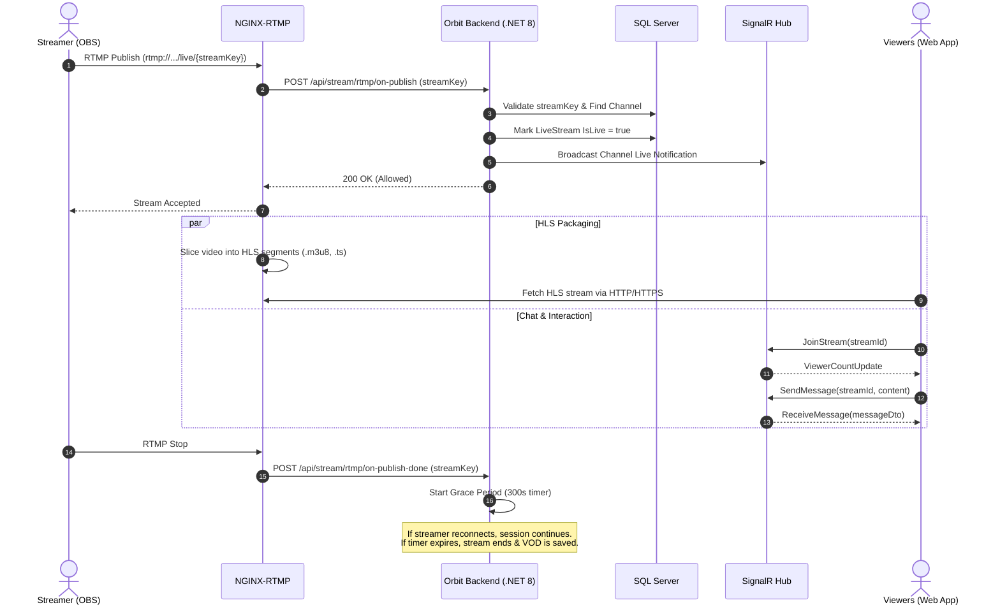

# 🪐 ORBIT — Backend API & Streaming Infrastructure

[](https://dotnet.microsoft.com/)
[](https://docs.microsoft.com/en-us/dotnet/csharp/)
[](https://docs.microsoft.com/aspnet/core)
[](https://docs.microsoft.com/ef/core)
[](https://dotnet.microsoft.com/apps/aspnet/signalr)
[](https://www.microsoft.com/sql-server)
[](https://github.com/arut/nginx-rtmp-module)
[](https://cloudinary.com/)

> **ORBIT** is a next-generation, high-performance live streaming platform built on **ASP.NET Core 8**, **SignalR**, and an **NGINX-RTMP** media pipeline. It powers real-time video ingestion, low-latency HLS broadcast distribution, interactive sub-second live chat, highlight clipping, automated VOD archiving, and robust channel moderation.

---

## 📑 Table of Contents

- [Architectural Overview](#-architectural-overview)
- [Key Features](#-key-features)
- [Tech Stack](#-tech-stack)
- [System Architecture & Ingestion Flow](#-system-architecture--ingestion-flow)
- [Getting Started & Local Setup](#-getting-started--local-setup)
- [Configuration & Environment Variables](#-configuration--environment-variables)
- [Streaming Setup with OBS](#-streaming-setup-with-obs)
- [SignalR Real-Time Chat Protocol](#-signalr-real-time-chat-protocol)
- [API Reference Overview](#-api-reference-overview)
- [Repository Directory Structure](#-repository-directory-structure)
- [Extended Documentation](#-extended-documentation)

---

## 🏛 Architectural Overview

```
                          ┌────────────────────────┐
                          │   Broadcaster (OBS)    │
                          └───────────┬────────────┘
                                      │ RTMP (port 1935)
                                      ▼
                          ┌────────────────────────┐
                          │   NGINX-RTMP Server    │
                          └─────┬────────────┬─────┘
           RTMP Callbacks       │            │ Transmuxed HLS (.m3u8 / .ts)
  (on_publish / on_record_done) │            │
                                ▼            ▼
┌─────────────────────────────────┐   ┌────────────────────────┐
│     OrbitBackend (.NET 8)       │   │    Frontend Web App    │
│  ├── REST API Controllers       │   │  (Video.js / HLS.js)   │
│  ├── SignalR StreamChatHub      │   └───────────┬────────────┘
│  ├── GracePeriod Background Svc │               │
│  └── EF Core 8 (SQL Server)     │ ◄─────────────┘
└────────────────┬────────────────┘  SignalR WebSockets (port 5000)
                 │
                 ├── Cloudinary (Avatars, Banners, Custom Emotes, Clips)
                 └── SMTP Relay (Email OTP & Account Activation)
```

---

## 🚀 Key Features

### 1. Live Video Ingestion & Delivery
- **RTMP Ingestion**: Connects seamlessly with OBS, Streamlabs, Prism Live, or any standard RTMP broadcaster (`rtmp://localhost:1935/live`).
- **Low-Latency HLS Playback**: Real-time transmuxing from RTMP into fragmented HLS streams (`.m3u8`) with custom segment lengths.
- **Dynamic Stream Key Management**: Cryptographically secure stream keys generated per channel, validated on publish via NGINX HTTP webhooks (`on_publish`).
- **Stream Reconnection Grace Period**: A dedicated `BackgroundService` keeps the broadcast session alive for configurable window (default 300s) during OBS crashes or intermittent network drops, avoiding fractured sessions and retaining viewers.
- **Automated VOD Archiving**: Broadcast recordings are captured on stream termination (`on_record_done`), automatically merged across intermittent reconnects, and made available for instant on-demand playback.

### 2. Real-Time Interactive Chat (SignalR)
- **Sub-Second Messaging**: Powered by `StreamChatHub`, distributing chat messages instantly across stream viewer groups.
- **Synchronized Live Viewer Count**: Concurrent viewer tracking engine (`ViewerTracker`) that increments and decrements on join/leave and pushes live counts.
- **Custom Channel Emotes**: Streamers can upload custom emotes with `:shortcode:` syntax, hosted via Cloudinary and rendered inline.
- **Role-Based Chat Badges**: Visual recognition for `Broadcaster`, `Moderator`, and platform `OG User` (first 100 registered platform pioneers).
- **Emotes-Only Chat Mode**: Broadcasters and moderators can toggle emote-only mode on the fly to curb text spam.
- **Sliding-Window Anti-Spam**: In-memory rate limiting preventing chatter flooding.

### 3. Highlights & Clips Engine
- **Live Stream Clipping**: Slices highlights directly from active broadcasts or VOD recordings via the companion media clipping microservice or Cloudinary integration.
- **Dedicated Clips Feed & Player**: Centralized discovery for viral platform highlights, ranked by views and recency.
- **Unique View Tracking**: Anti-duplication view tracker recording viewer impressions per authenticated user or visitor session.

### 4. Creator Studio & Live Manager
- **Live Stream Manager**: Streamers monitor viewer numbers, session duration, and peak audience concurrently while broadcasting.
- **Live Metadata Updates**: Broadcasters can update stream titles, categories, and descriptions mid-stream; updates are immediately broadcasted to all viewers via SignalR without refreshing.
- **Channel Branding**: Full customization of avatar, banner, offline banner, channel bio, and social media handles.
- **Broadcast Archive & Analytics**: Lifetime statistics tracking total broadcast hours, peak viewership, total VOD and clip views, and unique chatters count.

### 5. Channel Moderation (Mod View)
- **Dedicated Moderator Dashboard**: Channel owners can recruit moderators with dedicated privileges.
- **Live Moderation Actions**:
  - **Timeouts**: Temporarily mute offenders (custom duration with real-time countdown).
  - **Channel Bans / Unbans**: Permanently ban problematic users from channel chat.
  - **Message Purging**: Instant single-message deletion with room-wide SignalR sync.

### 6. Authentication, Security & Governance
- **JWT & Refresh Tokens**: Secure token rotation with claims-based authorization.
- **Google OAuth Login**: Seamless one-tap social authentication with automatic profile provisioning.
- **Email OTP Verification**: Two-factor email activation and password reset tokens via MailKit.
- **Role-Based Access Control (RBAC)**: System-level roles (`Admin`, `Streamer`, `User`) and channel-level roles (`Owner`, `Moderator`).
- **Comprehensive Admin Panel**: Platform-wide controls to monitor active streams, force-end rogue broadcasts, manage categories, moderate clips/VODs, and review platform metrics.

---

## 🛠 Tech Stack

| Layer | Technologies |
|---|---|
| **Backend Framework** | .NET 8 (C# 12), ASP.NET Core Web API |
| **Data Access & ORM** | Entity Framework Core 8, Microsoft SQL Server |
| **Real-Time Communication** | ASP.NET Core SignalR (WebSockets / SSE) |
| **Media & Streaming** | NGINX-RTMP Module, HLS Transmuxing, FFmpeg |
| **Cloud Storage** | Cloudinary .NET SDK (Images, Emotes, Video Clips) |
| **Identity & Security** | ASP.NET Core Identity, JWT Bearer Tokens, Google OAuth API |
| **Email Delivery** | MailKit & MimeKit (SMTP relay with HTML templates) |
| **Mapping & Documentation** | AutoMapper, Swashbuckle / OpenAPI (Swagger) |

---

## 🔄 System Architecture & Ingestion Flow



---

## ⚡ Getting Started & Local Setup

### Prerequisites

1. **[.NET 8.0 SDK](https://dotnet.microsoft.com/download/dotnet/8.0)** or higher.
2. **[Microsoft SQL Server](https://www.microsoft.com/en-us/sql-server/sql-server-downloads)** (LocalDB, Express, or SQL Server Docker).
3. **[OBS Studio](https://obsproject.com/)** (Optional, to broadcast live test streams).

---

### Step-by-Step Installation

#### 1. Clone the Repository
```bash
git clone https://github.com/A7medhanysadek/ORBIT.git
cd ORBIT
```

#### 2. Configure Database & Secrets
Open `OrbitBackend/appsettings.json` and ensure your database connection string and API keys are set:

```json
{
  "ConnectionStrings": {
    "DefaultConnection": "Server=localhost;Database=OrbitDb;Trusted_Connection=True;MultipleActiveResultSets=true;TrustServerCertificate=True"
  },
  "JWT": {
    "Key": "YOUR_STRONG_SECRET_KEY_AT_LEAST_32_CHARS_LONG",
    "Issuer": "OrbitBackend",
    "Audience": "OrbitBackendUsers",
    "AccessTokenExpirationMinutes": 60,
    "RefreshTokenExpirationDays": 7
  },
  "Cloudinary": {
    "CloudName": "your-cloud-name",
    "ApiKey": "your-api-key",
    "ApiSecret": "your-api-secret"
  }
}
```

#### 3. Apply Entity Framework Migrations
```bash
cd OrbitBackend
dotnet ef database update
```
*(Roles such as `Admin`, `Streamer`, `User` and initial system categories are automatically seeded on first launch).*

#### 4. Launch the .NET Web API
```bash
cd OrbitBackend
dotnet run
```
The API will launch at `http://localhost:5000` (or `https://localhost:7001`).
Swagger UI is accessible at:
```
http://localhost:5000/swagger
```

---

## 🎥 Streaming Setup with OBS

1. Open **OBS Studio** $\rightarrow$ **Settings** $\rightarrow$ **Stream**.
2. **Service**: Select `Custom...`
3. **Server**: `rtmp://localhost:1935/live`
4. **Stream Key**: Obtain your channel's stream key via:
   - Creator Studio on the frontend, OR
   - Call `GET /api/stream/key` (with your JWT Bearer token).
5. Click **Apply** $\rightarrow$ **Start Streaming**.
6. The stream will immediately be live and playable at:
   `https://localhost:8443/hls/{your-stream-key}.m3u8`

---

## 💬 SignalR Real-Time Chat Protocol

Clients connect to the real-time hub endpoint:
```
ws://localhost:5000/hubs/stream-chat?access_token={JWT_TOKEN}
```

### Client Invocations (Methods you call)

| Method | Parameters | Description |
|---|---|---|
| `JoinStream` | `streamId: int` | Enters a stream room and registers as an active viewer. |
| `LeaveStream` | `streamId: int` | Leaves the room and decrements the viewer count. |
| `SendMessage` | `streamId: int, content: string` | Sends a message (checks timeouts, bans, rate limits, and emotes-only). |
| `DeleteMessage` | `streamId: int, messageId: long` | Purges a message (moderator / channel owner only). |
| `SetEmotesOnly` | `streamId: int, enabled: bool` | Toggles emotes-only mode for the chat room. |

### Server Broadcasts (Events you listen for)

| Event | Payload | Description |
|---|---|---|
| `ReceiveMessage` | `ChatMessageDto` | Broadcast when a new message is received. |
| `MessageDeleted` | `messageId: long` | Broadcast when a moderator removes a message. |
| `ViewerCountUpdate` | `streamId: int, count: int` | Real-time concurrent viewer count changes. |
| `UserTimedOut` | `username: string, duration: int` | Notifies viewers that a chatter has been timed out. |
| `UserBanned` | `username: string` | Broadcast when a user is banned from the channel. |
| `UserUnbanned` | `username: string` | Broadcast when a user's ban is revoked. |
| `EmotesOnlyToggled` | `enabled: bool` | Real-time toggle state of emotes-only mode. |
| `ReceiveNotification`| `NotificationDto` | Instant notification pushed to specific user. |

---

## 📡 API Reference Overview

| Controller | Base Route | Key Operations |
|---|---|---|
| **Auth** | `/api/auth` | Register, Email OTP Confirmation, Login, Refresh Token, Google OAuth Login, Forgot/Reset Password. |
| **Accounts** | `/api/accounts` | Current user profile details, Change Password. |
| **User Profile** | `/api/userprofile` | Upload/delete avatar, View user public profiles. |
| **Channel** | `/api/channel` | Channel profile, Banners, Socials, Follow/Unfollow, Emotes management, Moderator team. |
| **Stream** | `/api/stream` | Stream keys, Start/End broadcast, RTMP callbacks (`on-publish`, `on-record-done`), Media server config. |
| **Dashboard** | `/api/dashboard` | Creator studio metrics, Live manager telemetry, Stream analytics, Lifetime stats. |
| **Chat** | `/api/chat` | Chat message history retrieval, Timestamped message ranges for VOD replay. |
| **Moderation** | `/api/moderation` | Timeout, Ban, Unban, Delete message, Check user moderation status. |
| **Clips** | `/api/clip` | Slice highlight clips, List top clips, Category clips, Record clip views, Delete clips. |
| **VODs** | `/api/vod` | Channel VOD archive, VOD detail with synced chat replay, Record VOD view, Delete VOD. |
| **Categories** | `/api/category` | Category listings, Slug queries, Streams and clips filtered by category. |
| **Notifications** | `/api/notification`| In-app notification center, Mark notifications read, Unread counters. |
| **Admin** | `/api/admin` | Platform statistics, Manage users, Toggle platform bans, Manage categories, Force-end live streams. |

> 📖 **Full Endpoint Documentation**: Check out [`docs/API_DOCUMENTATION.md`](docs/API_DOCUMENTATION.md) for full request/response schemas, DTOs, and error codes.

---

## 📂 Repository Directory Structure

```
OrbitBackend/
├── OrbitBackend/                   # ASP.NET Core 8 Web API Project
│   ├── Configuration/              # Dependency injection, Identity, JWT & Swagger extensions
│   ├── Controllers/                # 13 REST API Controllers
│   ├── Data/                       # AppDbContext, entity configurations & seeders
│   ├── DTOs/                       # Strongly typed Request / Response DTOs
│   ├── Hubs/                       # SignalR StreamChatHub & real-time protocols
│   ├── Mapping/                    # AutoMapper profiles
│   ├── Middleware/                 # Global exception handler & custom middleware
│   ├── Models/                     # EF Core Domain Entities (User, Channel, Stream, etc.)
│   ├── Services/                   # Core business logic & external integrations
│   │   ├── Interfaces/             # Service contracts
│   │   ├── AuthService.cs          # Identity, JWT, Google OAuth & OTP logic
│   │   ├── StreamService.cs        # RTMP validation, lifecycle & session management
│   │   ├── StreamGracePeriodService.cs # Background worker for reconnect resilience
│   │   ├── ViewerTracker.cs        # Thread-safe in-memory viewer tracking
│   │   ├── ClipService.cs          # Clip slicing & view tracking
│   │   ├── VodService.cs           # VOD archiving & chat replay
│   │   ├── DashboardService.cs     # Creator studio analytics & metrics
│   │   ├── ModerationService.cs    # Bans, timeouts, and mod permissions
│   │   ├── CloudinaryService.cs    # Media asset uploads & deletions
│   │   ├── MailService.cs          # SMTP email delivery for OTPs
│   │   └── NginxService.cs         # Media server configuration manager
│   ├── Templates/                  # HTML email templates (activation, password reset)
│   ├── Program.cs                  # Web application entry point & pipeline configuration
│   └── appsettings.json            # Configuration settings & connection strings
│
└── docs/                           # Extended Project Documentation
    ├── API_DOCUMENTATION.md        # Comprehensive API Endpoints Specification
    └── ARCHITECTURE.md             # Deep-dive Architecture & Lifecycle Specs
```

---

## 📚 Extended Documentation

For detailed technical references:
- **[Full REST API Specification](docs/API_DOCUMENTATION.md)**: Detailed JSON payloads, query parameters, authorization requirements, and response models.
- **[System Architecture & Design Decisions](docs/ARCHITECTURE.md)**: State machines, background workers, grace period design, and concurrent data structures.

---

