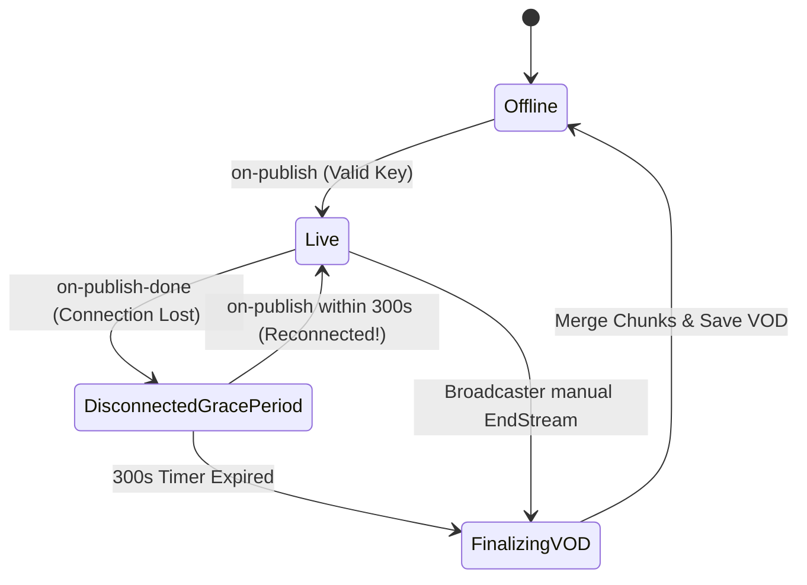
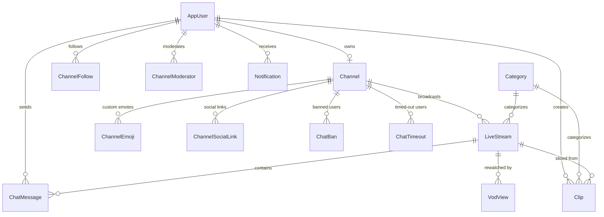

# 🏛 ORBIT — System Architecture & Engineering Deep-Dive

This document details the architectural design, concurrency patterns, streaming pipeline, and data flow of the **Orbit** live streaming backend.

---

## 📑 Table of Contents

1. [High-Level Architecture](#1-high-level-architecture)
2. [Media Pipeline & Ingest Lifecycle](#2-media-pipeline--ingest-lifecycle)
3. [Stream Reconnection & Grace Period State Machine](#3-stream-reconnection--grace-period-state-machine)
4. [Real-Time SignalR Architecture & Concurrency Model](#4-real-time-signalr-architecture--concurrency-model)
5. [Database Entity Relationship & Domain Model](#5-database-entity-relationship--domain-model)
6. [Highlight Clipping & VOD Storage Architecture](#6-highlight-clipping--vod-storage-architecture)
7. [Security, Token Lifecycle & Authentication](#7-security-token-lifecycle--authentication)

---

## 1. High-Level Architecture

Orbit follows a decoupled, service-oriented architecture designed to separate real-time video transport from the core business and interaction logic:

```
                                  ┌────────────────────────┐
                                  │   Broadcaster (OBS)    │
                                  └───────────┬────────────┘
                                              │ RTMP (TCP 1935)
                                              ▼
                                  ┌────────────────────────┐
                                  │   NGINX-RTMP Module    │
                                  └─────┬────────────┬─────┘
                 on_publish HTTP        │            │ HLS Transmuxing
                 Authentication Callback│            │ (.m3u8, .ts slices)
                                        ▼            ▼
┌─────────────────────────────────────────┐   ┌────────────────────────┐
│        OrbitBackend (.NET 8)            │   │      Browser Client    │
│  ├── REST API Controllers               │   │   (Video.js + HLS.js)  │
│  ├── SignalR StreamChatHub              │   └───────────┬────────────┘
│  ├── StreamGracePeriodService (Worker)  │               │
│  ├── ViewerTracker (Concurrent Engine)  │ ◄─────────────┘
│  └── Entity Framework Core 8            │  SignalR WebSockets (TCP 5000)
└────────────────────┬────────────────────┘
                     │
      ┌──────────────┼──────────────┐
      ▼              ▼              ▼
┌───────────┐  ┌───────────┐  ┌───────────┐
│SQL Server │  │Cloudinary │  │SMTP Relay │
│(Database) │  │(Media CDN)│  │ (Emails)  │
└───────────┘  └───────────┘  └───────────┘
```

### Core Components
1. **NGINX-RTMP Media Server**: Accepts raw H.264/AAC RTMP streams from software like OBS Studio, fragments video frames into HLS chunks, and executes HTTP callbacks to the backend for stream authorization and lifecycle events.
2. **Orbit Web API (.NET 8)**: The centralized RESTful service orchestrating users, channels, categories, notifications, permissions, and metadata.
3. **SignalR WebSocket Hub (`StreamChatHub`)**: Delivers sub-second broadcast chat, room presence, concurrent viewer counting, and moderation actions.
4. **Resilience Worker (`StreamGracePeriodService`)**: An asynchronous `BackgroundService` executing periodic polling loops to handle accidental network drops without terminating streams prematurely.
5. **Database (SQL Server)**: Relational storage managed via EF Core Code-First migrations with indexed queries and relational constraints.
6. **Cloudinary Asset Storage**: Stores unstructured static assets including channel avatars, banners, offline screens, and custom channel emotes.

---

## 2. Media Pipeline & Ingest Lifecycle

### Step 1: RTMP Ingestion & Key Verification
When a streamer presses "Start Streaming" in OBS:
1. OBS establishes a TCP connection on port `1935` to `rtmp://localhost:1935/live/{streamKey}`.
2. NGINX-RTMP intercepts the connection and makes an HTTP POST request to:
   ```
   POST http://localhost:5000/api/stream/rtmp/on-publish
   Body: name={streamKey}&addr=127.0.0.1
   ```
3. `StreamService.ValidateStreamKeyAsync(streamKey)` queries the database:
   - If the stream key matches an existing channel, the API marks the `LiveStream` as `IsLive = true`, logs the `StartedAt` timestamp, and responds with `HTTP 200 OK`.
   - If the key is invalid, the API returns `HTTP 404 Not Found`, causing NGINX to drop the RTMP handshake immediately.

### Step 2: Real-Time HLS Transmuxing
Once accepted:
- NGINX-RTMP slices incoming video keyframes into 2-second `.ts` transport stream segments.
- It maintains an active `.m3u8` playlist at `https://localhost:8443/hls/{streamKey}.m3u8`.
- Viewers consume the stream via Video.js / HLS.js adaptive player, requesting segment fragments over standard HTTPS.

---

## 3. Stream Reconnection & Grace Period State Machine

Live broadcasters frequently experience temporary packet loss, Wi-Fi drops, or OBS software restarts. A naive system marks the stream offline instantly, which:
- Forces viewers to leave.
- Splinters the VOD recording into multiple fragments.
- Resets viewer counters.

Orbit resolves this using an automated **Grace Period State Machine**:



### How the Grace Period Works:
1. When RTMP disconnects, NGINX fires `on-publish-done`.
2. Instead of marking `IsLive = false`, the backend records `DisconnectedAt = DateTime.UtcNow` and leaves `IsLive = true`.
3. If the streamer reconnects within `ReconnectGracePeriodSeconds` (default: 300s):
   - The reconnecting RTMP session matches the existing `LiveStream` record.
   - `DisconnectedAt` is cleared back to `null`.
   - The broadcast continues seamlessly for all connected viewers.
4. If the timer exceeds 300s:
   - `StreamGracePeriodService` detects the expired session.
   - It ends the stream, computes total duration, merges any disconnected video recording chunks using FFmpeg, and transitions the recording into a permanent **VOD**.

---

## 4. Real-Time SignalR Architecture & Concurrency Model

### Thread-Safe Viewer Tracking (`ViewerTracker`)
Tracking thousands of concurrent viewers joining and leaving multiple streams requires lock-free or minimal-contention data structures.

Orbit implements `ViewerTracker` using `ConcurrentDictionary`:
```csharp
// ConcurrentDictionary<StreamId, ConcurrentDictionary<ConnectionId, byte>>
private readonly ConcurrentDictionary<int, ConcurrentDictionary<string, byte>> _streamViewers = new();
```
- **Joining**: O(1) insertion into the stream's connection set.
- **Leaving**: O(1) removal.
- **Count Queries**: Instant count of active connection keys.
- **Peak Calculation**: Atomically updates peak viewer count using `Math.Max`.

### Rate Limiting & Anti-Spam
To prevent chat flooding, `StreamChatHub` enforces a sliding-window rate limiter per authenticated user:
- Users may send at most **5 messages per 10-second rolling window**.
- Enforced using a thread-safe `ConcurrentDictionary<string, List<DateTime>>` with timestamp pruning.
- Violators receive an instant SignalR `Error` notification without affecting other chatters.

---

## 5. Database Entity Relationship & Domain Model



### Key Entities:
- **`AppUser`**: Inherits from `IdentityUser`, stores FullName, ProfilePictureUrl, IsOgUser, and JWT RefreshToken.
- **`Channel`**: Primary broadcaster profile entity, stores StreamKey, Bio, Avatar/Banner URLs, and SaveStreams flag.
- **`LiveStream`**: Represents a distinct broadcast session (Title, IsLive, StartedAt, EndedAt, PeakViewers, RecordingFileName).
- **`ChatMessage`**: Persisted chat messages with soft-delete (`IsDeleted`) and moderator audit trail (`DeletedByUserId`).
- **`Clip`**: Sliced highlight entries linked to Channel, Streamer, and Category, tracking denormalized `ViewCount`.

---

## 6. Highlight Clipping & VOD Storage Architecture

### Highlight Slicing (`ClipService`)
When a viewer triggers "Create Highlight Clip":
1. The client sends a request with duration (e.g. 30 seconds).
2. The request reaches `ClipService.SliceLiveClipAsync()`.
3. The backend delegates to the configured media server clipping endpoint to extract the requested duration from the live HLS buffer.
4. The generated MP4 clip is registered in the database, with automated thumbnail generation.
5. Alternatively, client-recorded or uploaded clips are hosted directly via Cloudinary.

### Chat Replay for VODs
Unlike standard video platforms that discard chat when a broadcast ends, Orbit stores every message with a high-precision `SentAt` timestamp.
- When watching a VOD, the frontend requests messages via `/api/chat/{streamId}/range`.
- Chat messages are synced with `video.currentTime`, providing an authentic live experience during rewatches.

---

## 7. Security, Token Lifecycle & Authentication

### JWT Token Generation & Rotation
- **Access Tokens**: Short-lived (60 minutes), signed with `HMAC-SHA256`, containing user claims (`sub`, `email`, `role`, `channelId`).
- **Refresh Tokens**: Cryptographically random 64-byte base64 strings stored in the database with a 7-day expiration.
- **Token Revocation**: Calling `/api/auth/revoke-token` immediately invalidates the stored refresh token in SQL Server.

### Google OAuth Verification
Instead of trusting unverified client claims, `AuthService.GoogleLoginAsync()` validates the received ID token directly against Google's tokeninfo API:
```
GET https://oauth2.googleapis.com/tokeninfo?id_token={credential}
```
The user's email, name, and profile picture are extracted from Google's verified response payload, automatically creating an account if one does not exist.
